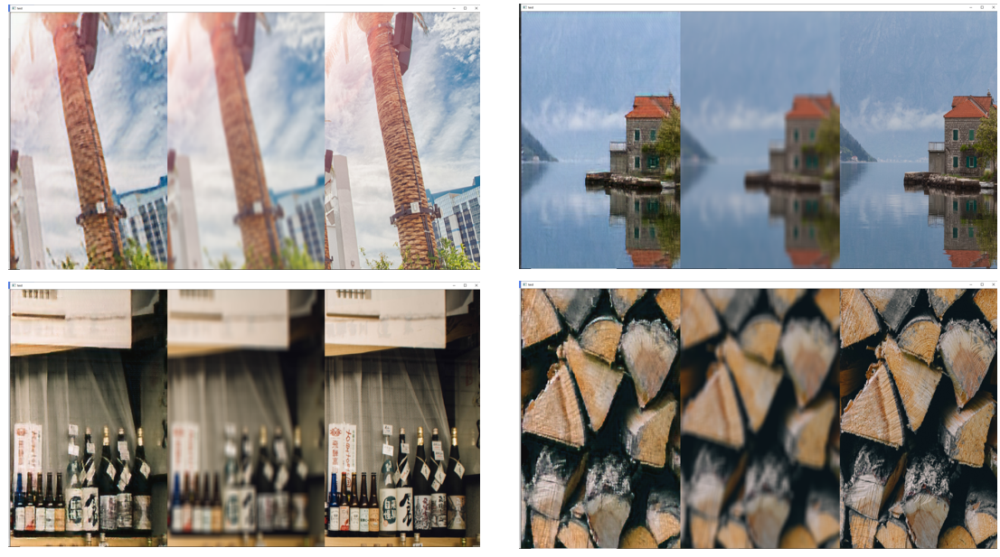
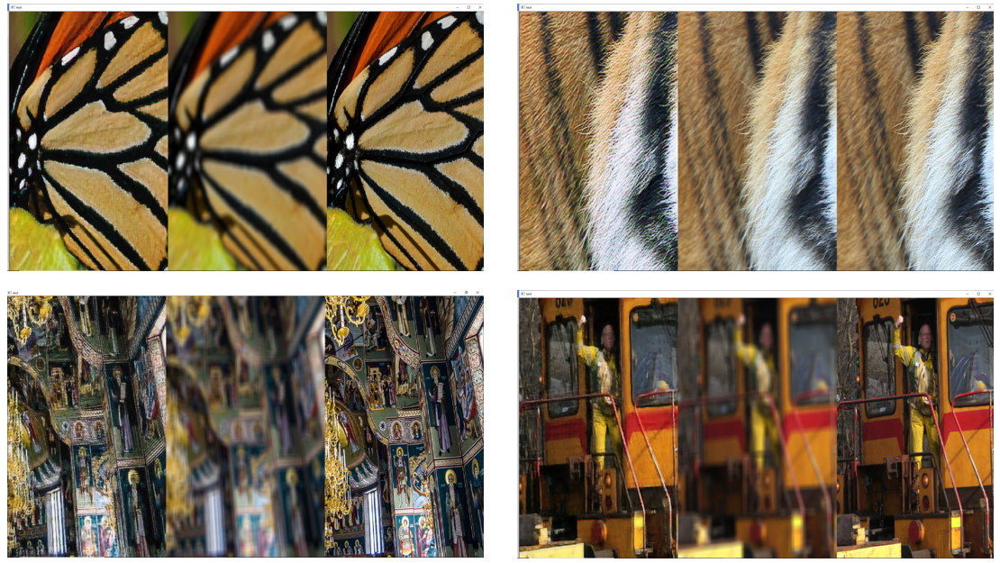
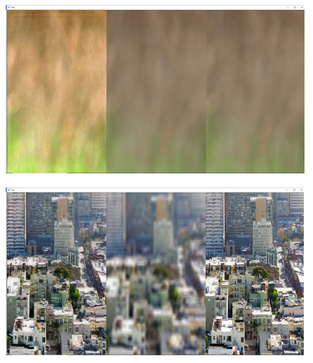

# CSRGAN解决图像超分任务

之前研究方向探索时期魔改了一版图像超分网络，虽然后面没有继续往下做这个方向，还是mark一下。

## 一、数据

训练数据[div-2k](https://data.vision.ee.ethz.ch/cvl/DIV2K/)是一个2k图像组成的数据集。

在模糊图像(L)-超分真值图像(H)的数据对构造方面，考虑图像金字塔尺度空间(即先Gaussian Blur + 降采样)和加性高斯噪声添加过程。

1. 把输入2k图像随机裁剪为512x512图像，作为真值H。
2. 高斯核函数方差σ进行0-50均匀采样，对H先进行高斯模糊，然后进行L=1-3倍随机下采样，并加入均值为0方差为w高斯噪声，再将图像立方插值上采样得到L。

为了和之前端到端的超分任务区别。在网络训练过程中，除了需要生成超分辨率图像S之外，还需要预测降质参数σ，w，L(类似盲超分的参数估计)。**注意**：后面实验效果表明额外参数预测会降低S的生成质量。

## 二、模型

采用SRGAN的基于GAN进行超分的网络架构——生成器G进行超分，判别器D用来进行S,H二分类。网络架构方面，G使用U-net作为Backbone，D使用VGG作为Backbone。

## 三、损失函数

损失函数包括GAN损失和参数预测的MSE损失两部分：Lloss=LGAN + λLpred。后面发现GAN训练不太稳定，于是又给生成器加入了S与R之间的图像MSE损失(相当于融合了基于GAN的超分损失和非基于GAN的超分损失)。

## 四、效果

### 4.1 主观效果

<h6 align="center">超分主观效果，左中右分别为超分图像(S)，低分辨率图像(L)，真值高分辨率图像(R)</h6>

从超分结果来看，细节处具有颜色保持，伪影的问题。

<h6 align="center">超分颜色保持、伪影问题</h6>

其中颜色保持主要与最后的颜色min-max归一化有关，min-max归一化容易受像素极端值影响，应使用Sigmoid进行归一化。而伪影这类影响主观感受的问题主要是MSE损失过度平滑导致的，如果完全使用GAN-based超分网络的话，伪影问题可以得到较好抑制。

### 4.2 客观量化指标

最终在测试集上PSNR 24.345，ssim = 0.749，量化效果不具备较大的竞争力，分析如下。

1. 高斯模糊取了一个较大的动态范围[0-50]，和一些公开数据集上固定σ有较大区别。
2. 基于GAN的算法确实PNSR,SSIM指标不太给力(虽然后面加入了MSE损失)。
3. 没有仔细调参。

## 四、参考资料

[1] Ledig C , Theis L , F Huszar, et al. Photo-Realistic Single Image Super-Resolution Using a Generative Adversarial Network[J]. IEEE Computer Society, 2016.[SRGAN code](https://github.com/aladdinpersson/Machine-Learning-Collection/tree/master/ML/Pytorch/GANs/SRGAN)

[2] Bell-Kligler S , Shocher A , Irani M . Blind Super-Resolution Kernel Estimation using an Internal-GAN[J]. 2019.

[3] Luo Z , Huang Y , Li S , et al. End-to-end Alternating Optimization for Blind Super Resolution[J]. 2021.

[4] Zhang K , Zuo W , Zhang L . Learning a Single Convolutional Super-Resolution Network for Multiple Degradations[J]. IEEE, 2018.  

**备注**:SRMD将模糊核、噪声、LR同时作为网络的输入，来得到一个更一般的适用于多种退化图像的超分辨率模型。也正是因为SRMD，后面有蛮多工作变成两步，即先估计退化参数，再用SRMD超分。

[5] J Gu, Lu H , Zuo W , et al. Blind Super-Resolution With Iterative Kernel Correction[J]. IEEE, 2019.
